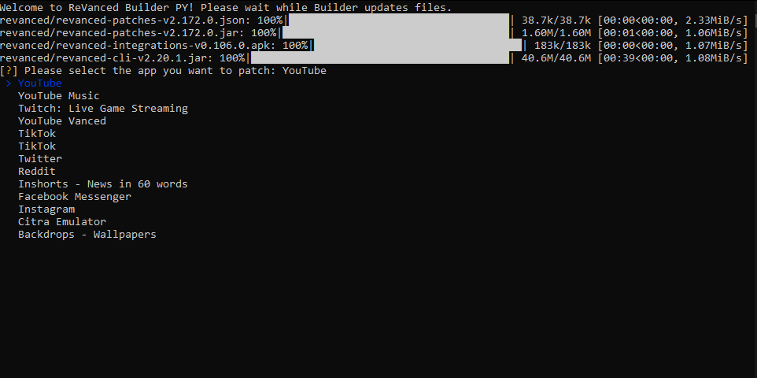
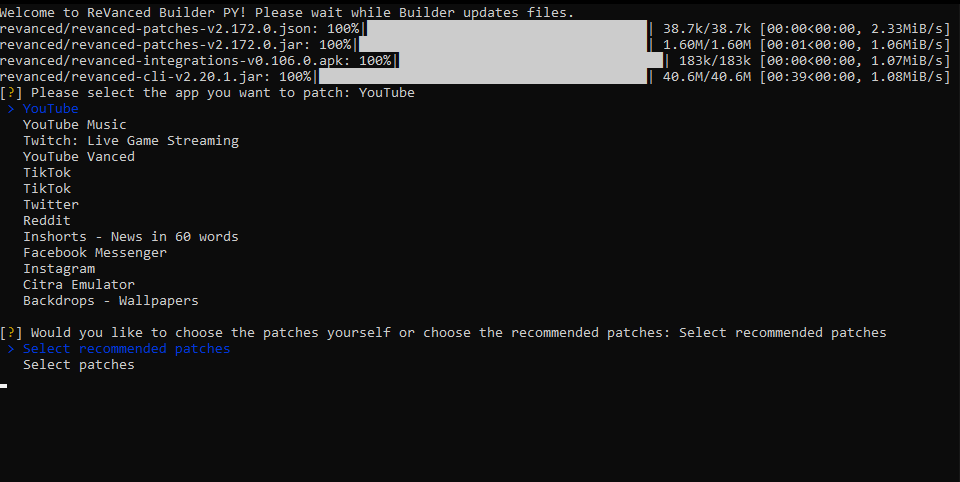
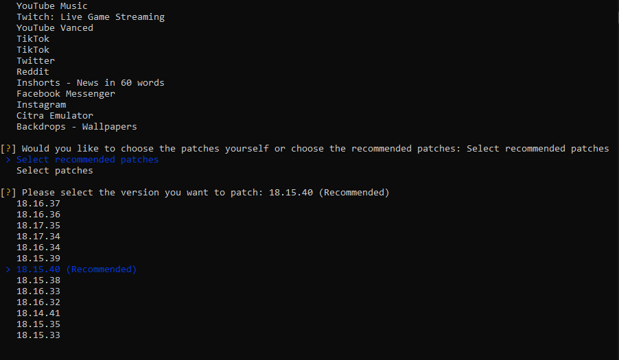
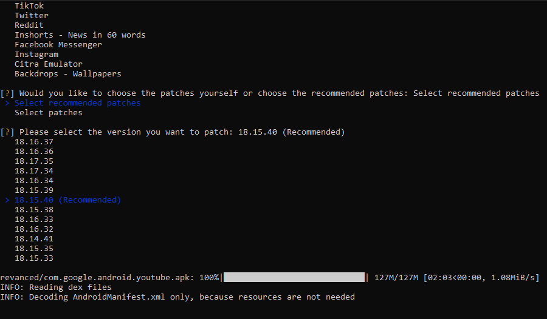
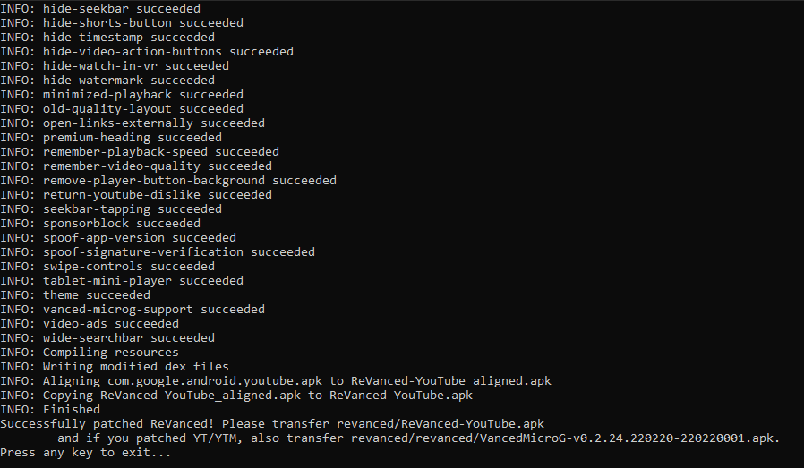

Kullanım
========

.. _installation:

RVB PY'ı indirme
----------------

RVB PY'ı indirmek için, ilk öncelikle GitHub deposuna (repository) gidiniz.

.. image:: images/releases.png

Gittikten sonra, "Releases" bölümüne tıklayınız.

.. image:: images/releases_page.png

"Releases" bölümüne tıkladıktan sonra, işletim sisteminize göre dosya ismine tıklayınız.

Not: Ubuntu isimli olan dosya, her Linux tabanlı cihazda çalışır.

.. _usage:

RVB PY'ı kullanma
-----------------

RVB PY'ı indirdikten sonra çalıştırınız.

RVB PY dosyaları indirdikten sonra, yamalamak istediğiniz uygulamayı seçiniz.

Seçtikten sonra, RVB PY sizden ya önerilen yamaları seçmenizi ya da sizin
yamaları seçmenizi isteyecek.

Not: Önerilen (Recommended) yamaları seçmenizi öneririm.

Yamaları seçtikten sonra ise RVB PY size hangi sürümü seçmek istediğinizi soracak.

Yama seçimindeki gibi burada da önerilen sürümü seçmenizi öneririm.

Not: Her zaman en yüksek olan sürümü seçmek iyi değildir ;)

Sürümü indirdikten sonra yamalama işlemi başlayacaktır. Bu işlem, bilgisayarınıza göre
5-10 dakika sürebilir.

En sonunda bitince ise `revanced` klasöründe yamalanan APK dosyası bulunacak. Eğer YT/YT Music 
yamaladıysanız, hem de Android cihazınıza Vanced microG yüklemeniz gerekiyor. Vanced microG'de `revanced`
klasöründe bulunacak.

.. _common_issues:

RVB PY'daki sıkca karşılışan hatalar
------------------------------------

Bazı hatalar, RVB PY'da belki karşılaşabilirsiniz.

1. Java kurulumunuz eski
^^^^^^^^^^^^^^^^^^^^^^^^

Eğer "JDK/Java was installed, but it's too old" hatasını alıyorsanız, www.azul.com/downloads/?package=jdk#zulu 
sayfasına gidip "Azul Zulu Builds of OpenJDK" bölümündeki "Download Free" butonuna basıp
kurulumunu yapınız.

Örnek hata:

.. image:: images/errors/error_oldjdk.png