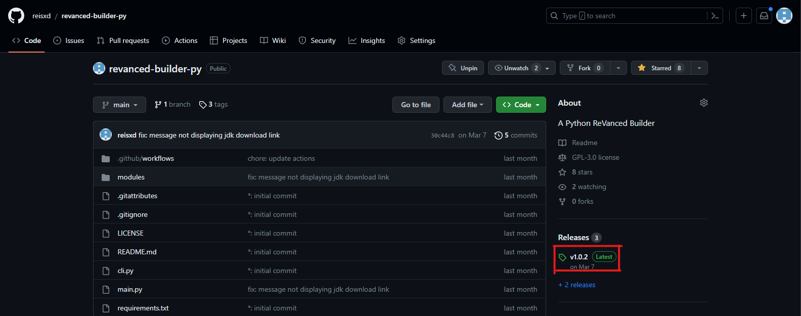
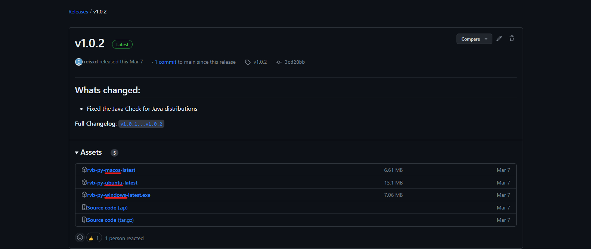
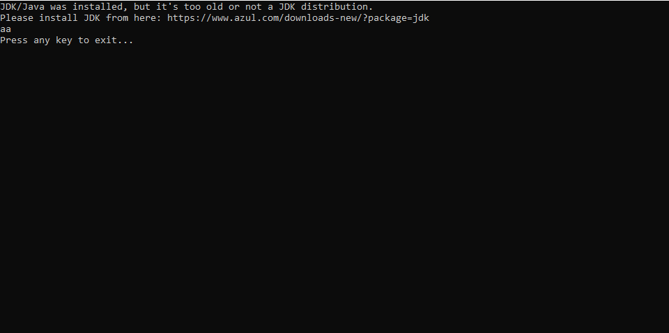

Kullanım
========

.. _installation:

RVB PY'ı indirme
----------------

RVB PY'ı indirmek için, ilk öncelikle GitHub deposuna (repository) gidiniz.

Gittikten sonra, "Releases" bölümüne tıklayınız.

"Releases" bölümüne tıkladıktan sonra, işletim sisteminize göre dosya ismine tıklayınız.

Not: Ubuntu isimli olan dosya, her Linux tabanlı cihazda çalışır.

.. _usage:

RVB PY'ı kullanma
-----------------

RVB PY'ı indirdikten sonra çalıştırınız.

.. _common_issues:

RVB PY'daki sıkca karşılışan hatalar
------------------------------------

Bazı hatalar, RVB PY'da belki karşılaşabilirsiniz.

1. Java kurulumunuz eski
^^^^^^^^^^^^^^^^^^^^^^^^

Eğer "JDK/Java was installed, but it's too old" hatasını alıyorsanız, www.azul.com/downloads/?package=jdk#zulu 
sayfasına gidip "Azul Zulu Builds of OpenJDK" bölümündeki "Download Free" butonuna basıp
kurulumunu yapınız.

Örnek hata:

